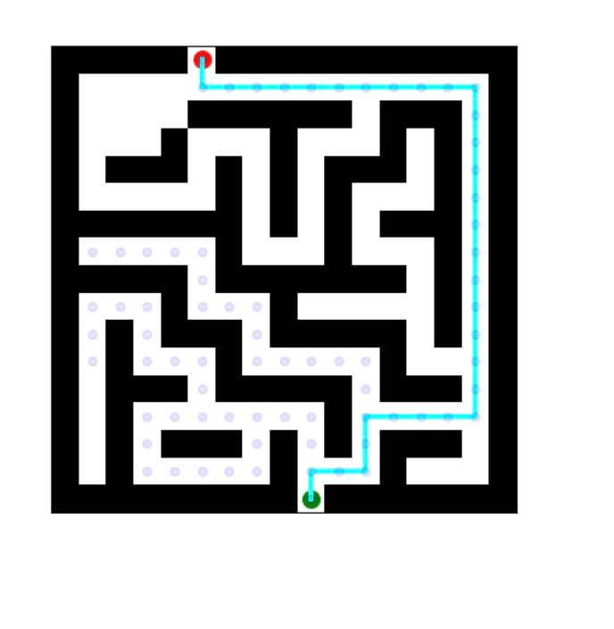

# Maze solver using A* algorithm

Simple maze solver using A* algorithm. The maze is represented as a 2D array of 0s and 1s, where 0s represent walls and
1s represent paths. The maze is solved by finding the shortest path from the start point to the end point.

For maze generation, the `maze_lib` library is used. The library is
available [here](https://github.com/john-science/mazelib)

## Solution

The solver outputs the shortest path from the start point to the end point. The path is represented as a list of
coordinates.

Additionally, the visualisation of the maze is done with visited nodes along the shortest path.
